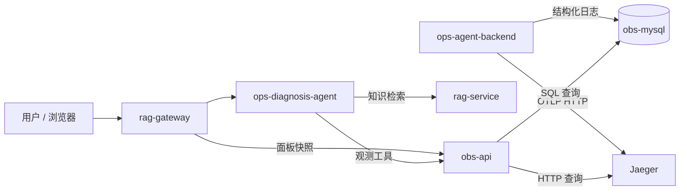

# obs-api

运维 Agent 项目的观测数据查询服务，使用 Go + Gin 实现。它从独立的观测 MySQL 查询结构化日志，从 Jaeger 查询 Trace，将原始数据整理成适合 Agent 分层诊断的统计、摘要和详情，同时为前端日志、Trace 面板提供缓存快照。

## 在整个项目中的位置

[ops-agent](https://github.com/wang-kang-tuoinai/ops-agent) 是一个基于日志、调用链和运维知识库的故障诊断项目：用户在观测面板发现异常、框选时间范围，再由 Agent 调用工具收集证据并给出分析。

| 模块 | 职责 |
| --- | --- |
| `ops-agent-backend` | 用户 CRUD 示例业务，接入 MySQL、Redis、RabbitMQ，产生结构化日志和 Trace，也是故障演练对象 |
| **`obs-api`** | 查询、聚合观测数据；提供六个日志/Trace 查询接口及可视化快照 |
| `ops-diagnosis-agent` | 基于 LangGraph 的诊断 Agent，组织工具调用，提供会话和 SSE 流式接口 |
| `rag-service` | 检索项目架构、排查手册及中间件技术文档，提供诊断知识 |
| `rag-gateway` | 托管聊天与观测面板，反向代理 Agent 和可视化请求 |



本服务负责提供证据；模型推理、对话持久化和页面展示由其他模块承担。

## 核心能力

### 日志：从服务概况到原始记录

- **stats**：可不传 `service`，按服务返回日志总量、ERROR 数量与占比、各级别数量，帮助发现异常服务。
- **templates**：指定服务，按日志模板与级别聚合，返回出现次数、首次/末次时间及最新样例；通过 `has_more` 提示截断。
- **search**：按服务、级别、路由、HTTP 方法、Trace ID、模板和关键词筛选原始日志，使用游标向更早的记录翻页。

日志 ERROR 占比是日志条数的比例，不是请求失败率；同一次请求可能产生多条日志。

### Trace：统计 → 搜索 → 详情

- **stats**：按指定服务的 `kind=server` 入口统计调用数量、P50/P95/P99 和 `ok/degraded/failed`，附带下游服务错误证据计数。
- **search**：按服务、入口 operation、状态和耗时筛选调用摘要，返回 `trace_id`、`entry_span_id` 和代表性错误，控制模型上下文大小。
- **detail**：按 Trace ID 返回精简 Span 树、各节点错误、耗时和 `self_ms`，支持节点数限制及缺失片段提示。

支持以非全局根的服务入口为分析起点。stats/search 只分析该入口及其后代，不将上游或兄弟分支算入；同一 Trace 多次进入某服务时，以 `(trace_id, entry_span_id)` 区分调用。detail 保留整条已采集链路的结构。

未指定 operation 的 stats 会先发现服务入口，再按 operation 分批查询，默认每个 operation 最多 1500 条候选；指定 operation 时默认最多 5000 条。接口返回查询状态、候选触顶及不完整提示，不将部分样本包装成完整统计。

### 面板：后台刷新，前端读取快照

| 面板 | 数据与刷新策略 |
| --- | --- |
| Trace | 最近 15 分钟入口摘要；后台串行查询 operation，逐批释放完整树。约每 15 秒重叠回查最近 2 分钟，按入口更新，约每 5 分钟全窗口校正 |
| 日志 | 最近 15 分钟按 10 秒分桶，返回各日志级别数量；后台约每 15 秒重新聚合整个窗口并替换快照 |

两类面板使用独立后台 worker 和进程内有界缓存，分别最多缓存 8 个窗口；Trace 每窗口最多保留 20000 个入口摘要。支持不超过 15 分钟的固定历史窗口。首次请求返回加载状态，刷新失败时保留旧数据并标记过期/错误。实际刷新间隔受查询耗时和排队影响。

Trace 的 operation 筛选在服务摘要缓存内进行；日志按 `service + method/route + 窗口` 缓存。缓存不写入 Redis 或新数据库表，重启后重新加载。页面绘图、同步框选和填入诊断时间范围由 `rag-gateway` 实现。

## 快速启动

### 使用根项目 Docker Compose

在 **ops-agent 根目录**执行。若尚未拉取子模块，先运行 `git submodule update --init --recursive`。

```sh
# 启动数据依赖；obs-mysql 必须先就绪，业务后端负责创建日志表。
docker compose up -d --wait mysql obs-mysql redis rabbitmq jaeger
# 启动示例业务、注册事件消费者和观测 API。
docker compose up -d --build app consumer obs-api
```

这组服务可独立验证观测查询，无需配置模型密钥。向 `app` 的用户接口发送请求后，再查询日志与链路；完整聊天与知识检索演示还需要启动 Agent、RAG 和网关，并完成它们的配置与知识入库。

| 地址 | 用途 |
| --- | --- |
| `http://localhost:8082` | obs-api（宿主机 8082 → 容器 8081） |
| `http://localhost:8080/api/v1/users` | 示例业务列表接口，可用于产生观测数据 |
| `http://localhost:16686` | Jaeger UI |
| `http://localhost:8081` | 完整环境中的前端网关，**不是宿主机上的 obs-api** |

`obs-api` 不负责建表。`observability.logs` 及 `idx_svc_ts(service, ts)` 等索引由业务后端启动时迁移。`/health` 只检查观测数据库连接，不检查日志表是否存在、Jaeger 或其他组件是否健康。

### 本地运行 Go 服务

需要 Go 1.25+，以及已就绪的观测数据库、日志表和 Jaeger。在本仓库目录运行，以下为 PowerShell 示例：

```powershell
$env:ADDR = ":8082"
$env:OBS_MYSQL_DSN = "root:root@tcp(127.0.0.1:3307)/observability?charset=utf8mb4&parseTime=True&loc=Local"
$env:JAEGER_BASE_URL = "http://127.0.0.1:16686"
go run .
```

这里使用根 Compose 的本地开发账号。若容器版 obs-api 已占用 8082，请使用其他空闲端口。程序直接读取进程环境变量，不自动加载 `.env`。

## 配置

| 环境变量 | 默认值 | 说明 |
| --- | --- | --- |
| `ADDR` | `:8081` | 服务监听地址；与 Compose 的宿主机映射端口区分 |
| `OBS_MYSQL_DSN` | `root:root@tcp(127.0.0.1:3307)/observability?charset=utf8mb4&parseTime=True&loc=Local` | 观测日志数据库；Compose 内连接 `obs-mysql:3306` |
| `JAEGER_BASE_URL` | `http://jaeger:16686` | Jaeger 查询 API；本地运行需改为宿主机地址 |
| `TRACE_STATS_PER_OPERATION_LIMIT` | `1500` | 未指定 operation 时每次查询的候选上限，也用于 Trace 面板 |
| `TRACE_STATS_FOCUSED_LIMIT` | `5000` | 指定 operation 的 stats 候选上限 |
| `TRACE_ENTRY_SERVICE` | `ops-agent-backend` | 面板服务目录响应中的默认服务；不代替 stats/search 必填的 service |

候选上限必须满足 `1 <= PER_OPERATION_LIMIT < FOCUSED_LIMIT <= 5000`。这些是本服务的查询预算，不代表 Jaeger 在任意部署中都保证返回同样数量的数据。

## API 索引

除健康检查外，路由前缀为 `/api/v1`，均使用 GET。

| 路径 | 主要参数 | 文档 |
| --- | --- | --- |
| `/health` | 无 | 观测数据库连接检查 |
| `/logs/stats` | 可选 service、route、method、start/end | [日志统计](docs/logs-stats.md) |
| `/logs/templates` | 必填 service；可选 level、route、method、limit、start/end | [日志模板](docs/logs-templates.md) |
| `/logs/search` | 可选 service、level、route、method、trace_id、template、keyword、cursor、limit、start/end | 默认 50 条，最多 100 条；使用响应的 next_cursor 继续查询 |
| `/traces/stats` | 必填 service；可选 operation、start/end；不接受 limit | [Trace 统计](docs/traces-stats.md) |
| `/traces/search` | 必填 service；可选 operation、status、min_duration_ms、sort、limit、fetch_limit、start/end | [Trace 搜索](docs/traces-search.md) |
| `/traces/:trace_id` | 必填 trace_id；可选 max_spans | [Trace 详情](docs/traces-detail.md) |
| `/visual/services` | 无 | Jaeger 服务目录及默认服务 |
| `/visual/traces` | 必填 service；可选 operation、成对的 start_ms/end_ms | [Trace 面板](docs/traces-visual.md) |
| `/visual/logs` | 必填 service；可选成对的 method/route、start_ms/end_ms | [日志面板](docs/logs-visual.md) |

工具接口的 `start/end` 为 **Unix 秒**，默认最近一小时、最长七天；可视化接口的 `start_ms/end_ms` 为 **Unix 毫秒**，省略时为实时最近 15 分钟。`logs/search` 的游标是服务端返回的 `毫秒时间戳:id`，应原样传回。

PowerShell 查询示例（使用上面的 8082 地址）：

```powershell
Invoke-RestMethod "http://localhost:8082/health"
Invoke-RestMethod "http://localhost:8082/api/v1/logs/stats"
Invoke-RestMethod "http://localhost:8082/api/v1/logs/templates?service=ops-agent-backend&level=WARN"
Invoke-RestMethod "http://localhost:8082/api/v1/traces/stats?service=ops-agent-backend"
Invoke-RestMethod "http://localhost:8082/api/v1/traces/search?service=ops-agent-backend&min_duration_ms=300&limit=5"
Invoke-RestMethod "http://localhost:8082/api/v1/visual/logs?service=ops-agent-backend"
```

## 结果解释与当前边界

- `ok` 表示已采集范围内没有有效错误，不等于 HTTP 2xx，也不代表低延迟；入口失败为 `failed`，入口未失败但后代有有效错误为 `degraded`，后者不一定执行过业务回源。
- 只排除符合项目标记规则的 MySQL 重复键预期冲突；不会笼统忽略所有 4xx 或数据库错误，详情仍保留原始证据。
- 下游错误按错误 Span 自己的 service 归属；同一次入口调用中同一服务只计一次。多个服务计数不能相加当作失败总数，也不能直接认定根因。
- `error_summary` 是代表性错误，不包含所有错误；`self_ms` 扣除直接子节点时间区间并集，但不是 CPU 时间。
- Jaeger 候选上限、采集缺失、查询失败和迟到 Span 都可能影响结果。应检查 `notices`、`warnings`、查询元信息及面板的 `partial/stale/error`，不能用空结果证明系统无异常。
- 本服务当前没有鉴权、租户隔离或自动修复能力，定位为本地开发与诊断演示中的观测查询层。

## 目录与测试

```text
main.go                 配置、依赖初始化与服务生命周期
internal/
  handler/              按日志、Trace、可视化接口功能拆分的 HTTP Handler
  router/               路由与健康检查
  logstore/             日志查询、聚合、面板缓存及包内测试
  tracestore/           Jaeger 适配、建树、分析、面板缓存及包内测试
tests/handler/          独立的 HTTP 接口契约测试
docs/                   接口与代码组织说明
```

在本仓库目录执行：

```sh
go test ./...
go test -race ./...
go test -coverpkg=./internal/... ./...
```

现有测试使用数据库驱动夹具、内存数据和本地 HTTP 测试服务器，覆盖日志聚合、Trace 多入口分析、查询契约与缓存刷新等行为，不要求真实 MySQL/Jaeger。数据竞争检查需要环境支持；这些测试不代替真实数据库执行计划和部署性能验证。

详细文件职责及测试目录划分见 [代码组织说明](docs/code-organization.md)。
